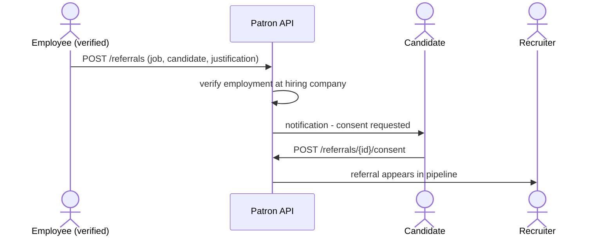

# Documentation Guide

How we document Patron: which documents exist, who writes them, what goes in
each, and when.

**Owner:** Umair — writes and maintains the SRS, ADRs, API descriptions,
user manual and sprint reports.
**Everyone else:** writes docstrings, endpoint descriptions and PR write-ups for
their own code. Documentation is in the [Definition of Done](STANDARDS.md#11-definition-of-done),
so it is not optional and not someone else's job.

---

## Start here

### The one rule

> **Documentation is written in the same sprint as the feature. Never at the end.**

A feature finished in October and documented in April gets documented wrong,
because nobody remembers the details. Writing it while the code is fresh takes
twenty minutes. Reconstructing it in April takes a day and is inaccurate.

### The five documents

| Document | Who reads it | Written when |
|---|---|---|
| **SRS** — `docs/srs/` | supervisor, examiners | one module section per sprint |
| **ADRs** — `docs/adr/` | us, future us, examiners | the day a decision is made |
| **API docs** — FastAPI `/docs` | frontend devs, examiners | with every endpoint |
| **User manual** — `docs/user-manual/` | end users, examiners | as each feature lands |
| **Sprint reports** — `docs/sprints/` | supervisor | review day, same day |

### Umair's first week

| # | Task | Why first |
|---|---|---|
| 1 | Ask the supervisor for the department's required SRS and thesis template | if they have one, ours must match it — do this before writing anything |
| 2 | Write ADRs 0001–0004 for decisions already made | 30 minutes, and they are the easiest thing to demo |
| 3 | Write the **Module 1 SRS section** using §3 of this guide | becomes the template for the other 14 |
| 4 | Create the folders in §1 | |

### Per-sprint routine

At the **start** of a sprint:
- read the sprint's issues, note which features need documenting

**During** the sprint:
- write the SRS section for the module being built
- write an ADR for any decision that gets argued about
- review the endpoint descriptions in the PRs you review

On **review day**:
- write `docs/sprints/sprint-<n>.md` — same day, ten minutes
- add the user-manual section for anything demoable

### Writing rules

| Rule | Why |
|---|---|
| Short sentences. One idea each. | this is a reference, not an essay |
| Tables over paragraphs for anything comparable | people scan documentation, they don't read it |
| Say what the system **does**, not what it **will** do | "The system validates…" not "The system should validate…" |
| Every requirement gets an ID | so code, tests and the thesis can point at it |
| Never invent a number | no "supports 10,000 users" unless it was measured |
| Screenshots go in `docs/images/`, named after what they show | `login-page-validation-error.png`, not `image3.png` |

---

## 1. Folder layout

Create these under `docs/`:

```
docs/
├── STANDARDS.md              (exists) code rules
├── GIT_WORKFLOW.md           (exists) git process
├── AGILE_PLAN.md             (exists) sprints and roles
├── DOCUMENTATION_GUIDE.md    (this file)
├── srs/
│   ├── README.md             index + how the SRS is organised
│   ├── 00-introduction.md    purpose, scope, definitions, references
│   ├── 01-overall-description.md   product perspective, users, constraints
│   ├── 02-module-01-auth.md
│   ├── 03-module-02-cv-builder.md
│   ├── …                     one file per module
│   └── 90-non-functional.md  performance, security, accessibility, usability
├── adr/
│   ├── README.md             index of decisions
│   ├── 0001-monorepo-over-two-repos.md
│   └── …
├── sprints/
│   ├── sprint-01.md
│   └── …
├── user-manual/
│   ├── README.md
│   ├── 01-getting-started.md
│   └── …
└── images/
    └── (screenshots and diagrams)
```

One file per module keeps the SRS reviewable in a PR. A single 200-page file is
unreviewable and produces conflicts every time two people touch it.

---

## 2. What each document is for

### SRS — Software Requirements Specification

The formal answer to *"what does this system do?"*. It turns `Features.pdf`
(which is a feature list) into numbered, testable requirements.

The difference:

| Features.pdf says | The SRS says |
|---|---|
| "1.2 Email/Password Fallback — manual signup for users without LinkedIn" | FR-1.2 with actor, preconditions, main flow, error flows, postconditions, and acceptance criteria you can test against |

### ADR — Architecture Decision Record

One short file per decision, recording what was decided and **why**. Written the
day the decision is made, while the reasoning is still in your head.

This is the document that most impresses an examiner, because it shows the
choices were reasoned rather than accidental — and it is the cheapest to write.

### API documentation

FastAPI generates the OpenAPI schema automatically from the code. It gives you
paths, methods and field types for free. What it cannot generate is meaning:
what an endpoint is for, what the rules are, what errors it returns and why.
That part is written by hand, in the code.

### User manual

How a person uses the product, with screenshots. Written as features land, so by
May it is already finished.

### Sprint reports

What was planned, what shipped, what slipped and why. Format is in
[AGILE_PLAN.md §7](AGILE_PLAN.md#7-tracking-on-github). Ten minutes on review
day. Fifteen of these are the project's development history.

> **Confirm first:** ask the supervisor whether the department mandates a
> specific SRS or thesis template (many use IEEE 830 or a local variant). If
> they do, ours must match it. The structure below is a sensible default based
> on IEEE 830, not a departmental requirement.

---

## 3. Writing the SRS

### Requirement ID scheme

```
FR-<module>.<feature>       functional requirement
NFR-<category>-<n>          non-functional requirement
UC-<module>.<n>             use case
```

IDs come straight from `Features.pdf`, so `FR-6.4` is Module 6, feature 4 —
"Add Referral Justification". Never renumber them. The whole point is that a
test, a commit and a thesis paragraph can all point at `FR-6.4` and mean the
same thing.

### Module section template

Copy this for every module.

````markdown
# Module 6 — Referral Engine (Employee Referral)

> ⭐ Core differentiator. Cannot be reduced or merged into Module 5.

## 6.0 Purpose

A structurally separate, higher-trust endorsement tied to verified current
employment at the hiring company. A verified employee selects a candidate,
writes a justification, and — after the candidate consents — the referral
enters a distinct HR-facing pipeline with its own Referral ID.

Tracked completely separately from Recommendations (Module 5) in status,
history and reputation.

## 6.1 Actors

| Actor | Role in this module |
|---|---|
| Employee (verified) | creates the referral |
| Candidate | must consent before it proceeds |
| Company recruiter | receives it in the pipeline |

## 6.2 Dependencies

| Depends on | Why |
|---|---|
| FR-1.11 Employer verification | eligibility is gated on verified employment |
| FR-3.1 Connections | you can only refer a connection |
| FR-4.1 Job posting | a referral targets a specific job |
| FR-11.2 Notifications | consent request must reach the candidate |

## 6.3 Functional requirements

### FR-6.2 — "Refer to My Company" CTA

**Description**
The job detail page shows a "Refer to My Company" action only when the viewer
has verified employment at the company that posted the job.

**Actor:** Employee (verified)

**Preconditions**
1. The user is authenticated.
2. The user has verified employment at company X (FR-1.11).
3. Job J was posted by company X and is open.

**Main flow**
1. The user opens the detail page for job J.
2. The system checks the user's verified employment against J's company.
3. The system displays the "Refer to My Company" action.

**Alternate flows**
- **A1** — no verified employment at X: the action is not rendered.
- **A2** — verification is pending review: the action is not rendered, and the
  system shows "Employer verification pending".
- **A3** — job J is closed or expired: the action is not rendered.

**Postconditions**
The user can begin the referral flow (FR-6.3).

**Acceptance criteria**
- [ ] The action appears for a user with verified employment at the posting company
- [ ] The action does not appear for any other user
- [ ] Calling the referral endpoint directly without verified employment returns 403
- [ ] The check is enforced server-side, not only by hiding the button

**Traceability:** Features.pdf Module 6.2

---

### FR-6.5 — Candidate consent

**Description**
A referral does not reach the company until the candidate accepts it.

**Actor:** Candidate

**Preconditions**
1. A referral exists in status `pending_candidate_consent`.
2. The candidate has been notified (FR-11.2).

**Main flow**
1. The candidate opens the referral request.
2. The candidate can see the referrer, the job, and the justification.
3. The candidate accepts.
4. The system moves the referral to `submitted` and notifies the company.

**Alternate flows**
- **A1** — candidate declines: status becomes `declined_by_candidate`; the
  referrer is notified; the company never sees it.
- **A2** — no response within the expiry window: status becomes `expired`.

**Postconditions**
The referral is either in the company's pipeline or terminated. It is never
visible to the company without consent.

**Acceptance criteria**
- [ ] A referral in `pending_candidate_consent` is not visible to the company
- [ ] Accepting moves it to `submitted` and notifies the company
- [ ] Declining notifies the referrer and never exposes it to the company
- [ ] Consent is enforced in the service layer, not the UI

**Traceability:** Features.pdf Module 6.5

## 6.4 Data

| Entity | Key fields | Notes |
|---|---|---|
| `referrals` | `id`, `referral_code`, `referrer_id`, `candidate_id`, `job_id`, `justification`, `status`, `is_bonus_eligible`, `created_at` | separate table from `recommendations` |

**Constraints**
- Unique on (`referrer_id`, `candidate_id`, `job_id`) — FR-6.11
- `status` transitions are one-way; no going back to `pending`

## 6.5 Business rules

| ID | Rule | Source |
|---|---|---|
| BR-6.1 | Only verified current employees of the hiring company may refer | 6.1, 6.2 |
| BR-6.2 | The candidate must consent before the company sees the referral | 6.5 |
| BR-6.3 | One referral per (referrer, candidate, job) triple | 6.11 |
| BR-6.4 | Referral statistics are tracked separately from Recommendations | 6.10 |
| BR-6.5 | Either party may withdraw while status is pending | 6.12 |

## 6.6 Out of scope for Phase 1

| Deferred | Where it goes |
|---|---|
| Bonus payout processing | stays internal to company HR (6.9) |
| Admin review of employment documents | Module 13 — Phase 2 |
| Fraud detection on referral patterns | Module 14 — Phase 2 |
````

### How to work through a module — the actual process

1. Open `Features.pdf` at the module.
2. Copy the module description into `6.0 Purpose`, rewritten as present-tense
   statements of what the system does.
3. List the actors. Ask: *who starts this, who is affected, who sees the result?*
4. List dependencies — which other features must exist first. Cross-check
   against the sprint order in [AGILE_PLAN.md §4](AGILE_PLAN.md#4-sprint-plan).
5. For each feature row in the PDF, write one `FR-x.y`. The one-line description
   in the PDF becomes the **Description**; you write the flows and criteria.
6. Write acceptance criteria as things you could actually check. If you cannot
   test it, it is not a requirement — it is a wish.
7. Pull the business rules out into their own table. These are the sentences
   containing "only", "must", "cannot", "before".
8. Write down what is explicitly **out of scope**. This is what protects the
   team when someone asks in April why fraud detection isn't there.

**Where the detail comes from:** the flows and error cases are not in the PDF.
Get them by asking the person building the module — usually in the PR
discussion. That conversation is the requirements-gathering, and the SRS is
where it gets written down.

### Non-functional requirements

One file, `docs/srs/90-non-functional.md`. These are the requirements about
*how well* the system works.

| Category | Example (write ours from what we actually decide) |
|---|---|
| Performance | NFR-PERF-1: job listing responds in under 500 ms for 20 items |
| Security | NFR-SEC-1: passwords stored using bcrypt; never logged or returned |
| Security | NFR-SEC-2: access tokens expire in 15 minutes; refresh in 7 days |
| Accessibility | NFR-A11Y-1: conforms to WCAG 2.1 AA — labels, keyboard, contrast |
| Usability | NFR-USE-1: every screen shows loading, error and empty states |
| Compatibility | NFR-COMP-1: latest Chrome, Firefox and Edge; responsive from 360 px |
| Maintainability | NFR-MAIN-1: lint and format enforced; PR review mandatory |
| Reliability | NFR-REL-1: a database outage returns a clear error, not a blank page |
| Data | NFR-DATA-1: endorsement records are soft-deleted, preserving the audit trail |

> **Do not invent numbers.** "Handles 10,000 concurrent users" is a claim an
> examiner can test and we cannot support. Either measure it or write the
> requirement as a target and say it is untested. Every number in this file
> should trace back to something we decided or measured.

### Use cases and diagrams

GitHub renders Mermaid inside a ```mermaid fence, so diagrams live in the
markdown rather than as separate image files — which means they show up in diffs
and can be reviewed.

````markdown

````

Worth drawing:

| Diagram | For |
|---|---|
| Use case diagram | one per module — actors and their actions |
| Sequence diagram | multi-step flows: consent, verification, token refresh |
| ER diagram | the data model, updated as tables are added |
| Architecture diagram | the three layers, once, in the introduction |

For hand-drawn diagrams, Excalidraw or draw.io export to PNG — put them in
`docs/images/` and commit the source file too, so they can be edited later.

---

## 4. Writing ADRs

One file per decision. Short — half a page is normal.

**Filename:** `docs/adr/<number>-<kebab-case-title>.md`, numbers never reused.

### Template

```markdown
# ADR 0002: JavaScript over TypeScript for the frontend

- **Status:** accepted
- **Date:** 2026-08-26
- **Decision by:** Rafay
- **Supersedes:** —

## Context
The frontend needed a language choice. TypeScript is the industry default for a
project of this size and would catch type errors at compile time. All three team
members are new to React, and two have not used TypeScript at all.

## Decision
Use JavaScript, with JSDoc typedefs for all API response shapes and props, and
strict ESLint rules.

## Consequences

**Positive**
- Lower learning curve; the team can start building immediately.
- Vite allows incremental migration later — files can be renamed to .tsx one
  at a time without a rewrite.

**Negative**
- No compile-time type checking; type errors surface at runtime.
- JSDoc discipline has to be enforced in review rather than by a compiler.

**Mitigation**
- JSDoc typedefs for all shared shapes are mandatory (STANDARDS.md §4.5).
- API response shapes are documented in shared/types/.

## Alternatives considered
- **TypeScript** — rejected for now on learning-curve grounds, not technical
  ones. Revisit if type errors become a recurring source of bugs.
```

### ADRs to write first

These decisions are already made; record them.

| # | Decision | Why it needs recording |
|---|---|---|
| 0001 | Monorepo instead of two repositories | first structural decision |
| 0002 | JavaScript instead of TypeScript | the choice most likely to be questioned |
| 0003 | Ant Design instead of Tailwind or MUI | affects every screen |
| 0004 | ESLint pinned to 9.x | looks like an oversight unless the reason is written down |
| 0005 | uv instead of pip or Poetry | |
| 0006 | React Query for server state, zustand for client state — Redux rejected | a viva favourite |
| 0007 | Referrals and Recommendations as separate tables, not one table with a type column | the core modelling decision of the product |
| 0008 | snake_case in JSON payloads | deviates from JS convention; needs the reason on record |

Numbers 0001–0006 can be reconstructed from the README, STANDARDS.md and the
merged PRs. 0007 and 0008 are in STANDARDS.md.

### When to write a new ADR

- A choice between two reasonable options, where you had to think
- Anything you would have to re-explain in three months
- A decision that reverses an earlier one — write a new ADR, mark the old one
  `superseded by ADR-00xx`, and never edit the old one

**Not** for: routine coding choices, variable names, anything with only one
sensible answer.

---

## 5. API documentation

FastAPI builds `/docs` from the code. Our job is to make it readable.

### What FastAPI gives you free

paths, methods, request and response schemas, field types, required/optional,
validation constraints.

### What you have to write

```python
@router.post(
    "/referrals",
    response_model=ReferralRead,
    status_code=status.HTTP_201_CREATED,
    summary="Refer a candidate into a job at your company",
    responses={
        403: {"description": "You do not have verified employment at this company"},
        404: {"description": "Job or candidate not found"},
        409: {"description": "You have already referred this candidate for this job"},
    },
)
async def create_referral(
    payload: ReferralCreate,
    session: SessionDep,
    current_user: CurrentUser,
) -> ReferralRead:
    """Refer one of your connections into a job at your own company.

    Requires verified current employment at the hiring company (FR-6.2). The
    candidate is notified and must consent before the referral becomes visible
    to the company (FR-6.5).

    Each referral gets a unique referral code and is tracked separately from
    recommendations.
    """
```

| Add | Why |
|---|---|
| `summary=` | the one-line label in the docs list |
| Docstring | the full explanation. Cite the FR id. |
| `responses={...}` | error cases with human descriptions — the schema cannot infer these |
| `Field(description=..., examples=[...])` in schemas | so a reader sees a real value, not just `string` |

Example on a schema field:

```python
class ReferralCreate(BaseModel):
    job_id: int = Field(description="The job being referred into", examples=[42])
    candidate_id: int = Field(description="Must be an existing connection", examples=[17])
    justification: str = Field(
        min_length=50,
        description="Why this candidate fits. Shown to the company.",
        examples=["Worked with Ayesha for two years on the payments team; she..."],
    )
```

### Umair's role here

You are not writing the endpoints — you are reviewing them. On every backend PR
you review, check:

- [ ] Does the endpoint have a `summary`?
- [ ] Does the docstring explain the rules, and cite the FR id?
- [ ] Are the error responses documented?
- [ ] Do the schema fields have descriptions and realistic examples?
- [ ] Open `/docs` — could a frontend developer use this endpoint without asking?

That last question is the whole test.

---

## 6. User manual

Written for someone who has never seen the product. Add a section as each
feature becomes demoable.

### Structure

```
docs/user-manual/
├── README.md              contents
├── 01-getting-started.md  signing up, verifying, completing a profile
├── 02-your-profile.md
├── 03-building-a-cv.md
├── 04-connections.md
├── 05-finding-jobs.md
├── 06-recommendations.md
├── 07-referrals.md
├── 08-alumni.md
└── 09-for-companies.md
```

### Section format

```markdown
## Requesting a recommendation

A recommendation is a vouch from anyone in your network. They do not need to
work at the company or share your university.

### Steps

1. Open the job you are interested in.
2. Click **Request a Recommendation**.

   

3. Choose a connection from the list.
4. Add a note explaining why you fit the role. This is sent with the request.
5. Click **Send request**.

Your connection is notified and can view your profile and CV before deciding.
You can track the status on **My Recommendations**.

### Notes
- A request expires if unanswered for 7 days.
- You can request only one recommendation per person per job.
- You can withdraw a pending request at any time.
```

| Rule | Why |
|---|---|
| Screenshot every screen you mention | a wall of text is unusable |
| Bold the exact button text | so the reader can find it |
| Number the steps | people follow numbers |
| End with a Notes section for limits and edge cases | this is where the "why can't I…" answers live |
| Never say "simply" or "just" | if it were simple, the manual would not need a section |

Screenshots go in `docs/images/`, named for what they show. Retake them when the
UI changes — an outdated screenshot is worse than none.

---

## 7. Sprint reports

Format and example in [AGILE_PLAN.md §7](AGILE_PLAN.md#7-tracking-on-github).

Written on review day, in ten minutes, from the milestone page. Include what did
**not** ship and why — that is the part a supervisor actually reads, and the
part that makes the next estimate better.

---

## 8. Mapping to the thesis

The final report is assembled from these documents, not written from scratch.
Typical chapter mapping:

| Thesis chapter | Comes from |
|---|---|
| Introduction, problem statement | `srs/00-introduction.md` |
| Literature review / existing systems | written separately — LinkedIn, Indeed, referral platforms |
| Requirements | the SRS module files + `90-non-functional.md` |
| System design | ADRs + architecture and ER diagrams + STANDARDS.md §2 |
| Implementation | ADRs + module SRS sections + the API docs |
| Testing | test files + STANDARDS.md §8 + bug-bash results |
| Project management | AGILE_PLAN.md + the 16 sprint reports |
| Conclusion, future work | the Phase 2 module list from `Features.pdf` |

> **Confirm the required chapter structure with the supervisor** — departments
> differ. The mapping above is the usual shape, not a rule. Doing this early
> means the documents are written into the right shape from the start.

This mapping is the reason documentation-as-you-go matters: by May the thesis is
an assembly job, not a writing job.

---

## 9. Per-sprint checklist

Copy into the sprint's tracking issue.

- [ ] SRS section written for this sprint's module
- [ ] ADR written for any decision that took discussion
- [ ] Endpoint summaries, docstrings and error responses reviewed on every backend PR
- [ ] `/docs` opened and checked — usable without asking a question?
- [ ] User manual section added for anything demoable
- [ ] Screenshots taken and committed to `docs/images/`
- [ ] Sprint report written on review day
- [ ] Any requirement that changed during the sprint updated in the SRS

Last item matters most. A feature that shipped differently from its SRS section
means the SRS is now wrong — and an SRS nobody trusts is worse than no SRS.
