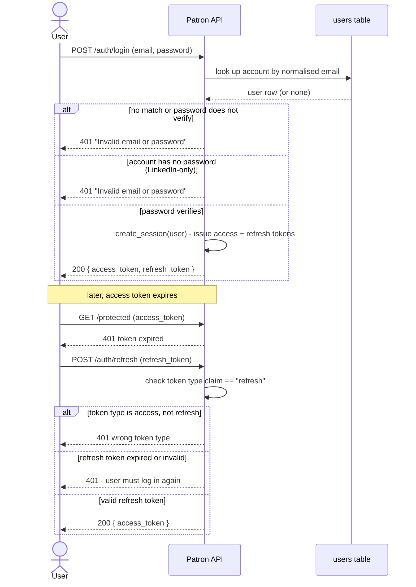

# Module 1 — Authentication

## 1.0 Purpose

Every other module depends on knowing who the user is, so authentication is
built first. A visitor creates an account with an email address and a
password, picking a role at the same time. Logging in returns a short-lived
access token and a longer-lived refresh token, which every protected
endpoint checks. LinkedIn OAuth is the intended primary sign-up route
(FR-1.1) but has not been built yet — see §1.6.

## 1.1 Actors

| Actor | Role in this module |
|---|---|
| Visitor | has no account yet; registers |
| Registered user | has an account; logs in, refreshes their session |

## 1.2 Dependencies

None. This is the first module — every other module depends on it.

## 1.3 Functional requirements

This section covers the Module 1 features that exist after Sprint 1:
FR-1.2, FR-1.3, FR-1.13. FR-1.1 (LinkedIn OAuth) is now the **primary**
sign-in route, with FR-1.2 as the fallback (design updated after this issue
was written — see #13, #25 and the issue #23 comment thread), but it is not
specified in detail here yet. Two things to confirm with the supervisor
before writing it up:

- LinkedIn's OpenID Connect product supplies name, profile picture, and a
  verified email — **not** a headline. Any earlier assumption that sign-up
  "imports name, photo, headline" is wrong; the headline will have to be
  user-entered.
- The account-linking rule below (BR-1.8) needs sign-off, since it decides
  when a LinkedIn identity is allowed to attach to an existing account.

FR-1.2 and FR-1.13 already anticipate FR-1.1 (a LinkedIn sign-up creates a
`User` with no password, matched through `user_identities`; sessions are
issued the same way regardless of provider — see FR-1.13), so this section
will not need to be rewritten when FR-1.1 lands, only extended with its own
entry.

### FR-1.2 — Register with email and password

**Description**
A visitor without a LinkedIn account can create an account by submitting an
email, a password, their full name, and a role. This is the fallback path —
FR-1.1 is primary.

**Actor:** Visitor

**Preconditions**
None.

**Main flow**
1. The visitor submits email, password, full name, and role to
   `POST /api/v1/auth/register`.
2. The system normalises the email (trim, lowercase).
3. The system checks that no existing account uses the normalised email.
4. The system hashes the password with bcrypt.
5. The system creates the `User` row and returns it (without the password).

**Alternate flows**
- **A1** — the normalised email is already registered: the system returns
  `409 Conflict` and creates nothing.
- **A2** — the password is under 8 characters, the email is not a valid
  address, the role is not one of `candidate` / `company` / `both`, or a
  required field is missing: the system returns `422 Unprocessable Entity`
  and creates nothing.

**Postconditions**
A `User` row exists with `is_email_verified = false` and `is_active = true`.
No `UserIdentity` row is created — that table is for OAuth providers only.

**Acceptance criteria**
- [x] A valid submission creates an account and returns it with `201`
- [x] The response never contains the password or its hash
- [x] The email is stored lowercase, and a duplicate is rejected
  case-insensitively (`Ali@x.com` collides with `ali@x.com`)
- [x] The full name is trimmed of surrounding whitespace
- [x] A duplicate email returns `409` and creates no row
- [x] A password under 8 characters, an invalid email, or an invalid role
  returns `422`
- [x] Registering does not create a `user_identities` row

**Traceability:** Features.pdf Module 1.2 — **status: implemented** (PR #31)

---

### FR-1.3 — Role selection at signup

**Description**
Every account is tagged Candidate, Company, or Both. On the email/password
path the role is required at registration (FR-1.2). Once LinkedIn sign-up
(FR-1.1) lands, an account created that way will have no role from the
provider and will need to be asked once, on first sign-in — that flow is not
built yet and is not specified in detail here.

**Actor:** Visitor

**Preconditions**
None.

**Main flow**
1. The role is one of the required fields on `POST /api/v1/auth/register`
   (FR-1.2) and is stored at creation time.

**Alternate flows**
- **A1** — an invalid role value is submitted: the system returns `422` and
  the role is not stored.

**Postconditions**
The account's `role` is one of `candidate`, `company`, `both`.

**Acceptance criteria**
- [x] `role` is required and validated against the three allowed values on
  registration (FR-1.2)
- [x] An invalid role value returns `422` and creates no account

**Traceability:** Features.pdf Module 1.3 — **status: implemented** for the
email/password path (PR #31). The LinkedIn first-sign-in prompt depends on
FR-1.1 and is not specified yet.

---

### FR-1.13 — Login and token refresh with JWT

**Description**
A registered user with a password logs in with their email and password and
receives a short-lived access token and a longer-lived refresh token. A
separate endpoint exchanges a valid refresh token for a new access token.

**Session issuance is provider-independent.** `create_session(user)` issues
the same access/refresh token pair regardless of whether the user
authenticated with a password (FR-1.2) or, once it lands, through LinkedIn
(FR-1.1). This requirement specifies session issuance and refresh; it does
not assume a password was involved in how the session started.

**Actor:** Registered user

**Preconditions**
1. The user has an account with a password set (FR-1.2).

**Main flow — login**
1. The user submits email and password to `POST /api/v1/auth/login`.
2. The system looks up the account by normalised email.
3. The system verifies the password against the stored bcrypt hash.
4. The system issues an access token (15 minutes) and a refresh token
   (7 days); both lifetimes are configured via `.env`, not hard-coded.
5. The access token payload carries the user id (`sub`), a token-type claim,
   and an expiry — nothing sensitive.

**Main flow — refresh**
1. The client submits a refresh token to `POST /api/v1/auth/refresh`.
2. The system checks the token's type claim is `refresh`, not `access`.
3. The system issues a new access token.

**Alternate flows**
- **A1** — no account matches the email, or the password does not verify:
  the system returns `401` with the generic message "Invalid email or
  password". The response is identical for both cases — it never reveals
  which one was wrong (STANDARDS.md §6, rule 10).
- **A2** — the account has no password (a future LinkedIn-only user, once
  FR-1.1 lands): login returns a clean `401`, not a server error.
- **A3** — the access token used against a protected endpoint has expired
  or is tampered with: the endpoint returns `401`.
- **A4** — an access token is submitted to `/auth/refresh` instead of a
  refresh token: the system rejects it based on the type claim.
- **A5** — the refresh token itself has expired or is invalid: the user must
  log in again.

**Postconditions**
The client holds a valid access token and refresh token pair.

**Acceptance criteria**
- [ ] Correct credentials return an access token and a refresh token
- [ ] Wrong password and unknown email return the same `401` message
- [ ] A null-password account attempting login gets a clean `401`, not a crash
- [ ] Access and refresh token lifetimes are read from settings, not hard-coded
- [ ] An expired or tampered token returns `401`
- [ ] `/auth/refresh` rejects an access token presented as a refresh token
- [ ] A valid refresh token returns a new access token
- [ ] `create_session(user)` is reusable by any auth path, not tied to password login
- [ ] The password hash is never included in any response

**Traceability:** Features.pdf Module 1.13 — **status: not yet implemented**
(#15, planned for Sprint 1; see AGILE_PLAN.md §4)

## 1.4 Data

| Entity | Key fields | Notes |
|---|---|---|
| `users` | `id`, `email` (unique, lowercase), `full_name`, `avatar_url`, `role`, `password`, `is_email_verified`, `is_active`, `created_at`, `updated_at` | `password` holds a bcrypt hash or null; never returned by any endpoint |
| `user_identities` | `id`, `user_id`, `provider`, `provider_user_id`, `provider_email`, `created_at`, `last_login_at` | one row per linked OAuth provider; unique on (`provider`, `provider_user_id`) |

**Constraints**
- Unique on `users.email` (stored lowercase, trimmed) — FR-1.2
- Unique on (`user_identities.provider`, `user_identities.provider_user_id`) —
  reserved for FR-1.1, not yet in use
- `users.role` is one of `candidate`, `company`, `both`, or null — FR-1.3

## 1.5 Business rules

| ID | Rule | Source |
|---|---|---|
| BR-1.1 | An email uniquely identifies one account, compared case-insensitively | 1.2 |
| BR-1.2 | A password is stored only as a bcrypt hash and is never returned by any endpoint | 1.2, 1.13 |
| BR-1.3 | A login failure never reveals whether the email or the password was wrong | 1.13 |
| BR-1.4 | A null-password account is refused cleanly by password login, not with a server error | 1.13 |
| BR-1.5 | `user_identities` holds one row per linked OAuth provider and is never written by the email/password path | 1.2 |
| BR-1.6 | A role, once set, is one of `candidate`, `company`, `both` and is not reset | 1.3 |
| BR-1.7 | Access and refresh token lifetimes are configuration, not hard-coded | 1.13 |
| BR-1.8 | A LinkedIn identity is attached to an existing account only when the provider reports the email as verified | 1.1, reasoning in #25 — **needs supervisor sign-off before FR-1.1 is written up** |

## 1.6 Out of scope for Phase 1

| Deferred | Where it goes |
|---|---|
| LinkedIn OAuth sign-up/sign-in itself (FR-1.1 flows, headline field, full acceptance criteria) | #25, Sprint 2 — needs supervisor sign-off first, see the note in §1.3 and BR-1.8 |
| Password reset / forgot password | Phase 2 |
| Email verification flow (the `is_email_verified` flag exists but nothing sets it yet) | later sprint, Module 1 follow-up |
| OAuth providers other than LinkedIn (Google, GitHub) | Phase 2 |
| Admin review of accounts, ban/deactivation UI | Module 13 — Phase 2 |
